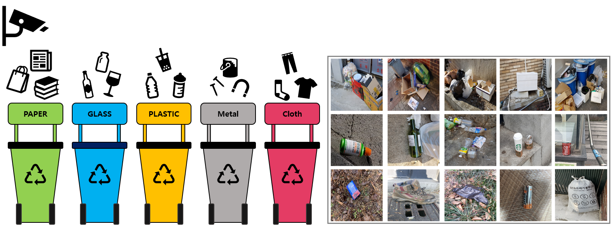
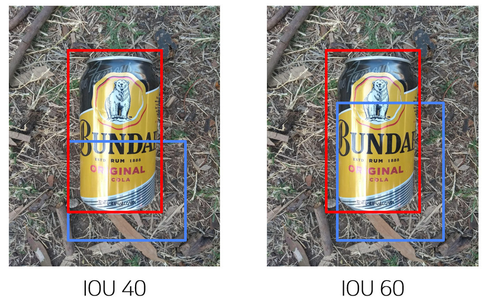

# 프로젝트 개요

바야흐로 대량 생산, 대량 소비의 시대. 우리는 많은 물건이 대량으로 생산되고, 소비되는 시대를 살고 있습니다. 
하지만 이러한 문화는 '쓰레기 대란', '매립지 부족'과 같은 여러 사회 문제를 낳고 있다.

분리수거는 이러한 환경 부담을 줄일 수 있는 방법 중 하나이다. 
잘 분리배출 된 쓰레기는 자원으로서 가치를 인정받아 재활용되지만, 잘못 분리배출 되면 그대로 폐기물로 분류되어 매립 또는 소각되기 때문이다.

따라서 우리는 사진에서 쓰레기를 Detection 하는 모델을 만들어 이러한 문제점을 해결해보고자 한다. 
문제 해결을 위한 데이터셋으로는 일반 쓰레기, 플라스틱, 종이, 유리 등 10 종류의 쓰레기가 찍힌 사진 데이터셋이 제공된다.

- **Input :** 쓰레기 객체가 담긴 이미지가 모델의 인풋으로 사용된다. 
또한 bbox 정보(좌표, 카테고리)는 model 학습 시 사용이 된다. 
bbox annotation은 COCO format으로 제공된다.
- **Output :** 모델은 bbox 좌표, 카테고리, score 값을 리턴한다. 
이를 submission 양식에 맞게 csv 파일을 만들어 제출한다.

#### **평가 기준**

Test set의 mAP50(Mean Average Precision)로 평가

Object Detection에서 사용하는 대표적인 성능 측정 방법.

Ground Truth 박스와 Prediction 박스간 IoU(Intersection Over Union, Detector의 정확도를 평가하는 지표)가 50이 넘는 예측에 대해 True라고 판단함.

* * *
# 프로젝트 팀 구성 및 역할

송영동: 1-stage model

정상헌: Backbone, 1-Stage model, 2-Stage model

최휘준: Backbone, Neck, Scheduler

김형훈: Validation-set search, Preprocessing, Pseudo labeling

김동영 : EDA, Fine-tuning, Postprocessing
* * *
# 프로젝트 수행 과정 및 결과
## Model
### Detector
[1-Stage 실험](https://github.com/boostcampaitech4lv23cv1/level2_objectdetection_cv-level2-cv-04/tree/master/experiments/Detector/1-Stage#1-stage)  

[2-Stage 실험](https://github.com/boostcampaitech4lv23cv1/level2_objectdetection_cv-level2-cv-04/tree/master/experiments/Detector/2-Stage#2-stage)  

[Anchor Generator 실험](https://github.com/boostcampaitech4lv23cv1/level2_objectdetection_cv-level2-cv-04/tree/master/experiments/Detector/Anchor_Generator#anchor-generator)  

### Backbone
[Faster R-CNN Backbone 실험](https://github.com/boostcampaitech4lv23cv1/level2_objectdetection_cv-level2-cv-04/tree/master/experiments/Backbone#faster-r-cnn-%EC%8B%A4%ED%97%98)  

[Cascade R-CNN Backbone 실험](https://github.com/boostcampaitech4lv23cv1/level2_objectdetection_cv-level2-cv-04/tree/master/experiments/Backbone#cascade-r-cnn-backbone-%EC%8B%A4%ED%97%98)  

[Backbone 모델 :  swin-T, swin-L에 따른 성능 비교 실험](https://github.com/boostcampaitech4lv23cv1/level2_objectdetection_cv-level2-cv-04/tree/master/experiments/Backbone#backbone-%EB%AA%A8%EB%8D%B8---swin-t-swin-l%EC%97%90-%EB%94%B0%EB%A5%B8-%EC%84%B1%EB%8A%A5-%EB%B9%84%EA%B5%90-%EC%8B%A4%ED%97%98)  

### Neck
[512사이즈 Neck 실험](https://github.com/boostcampaitech4lv23cv1/level2_objectdetection_cv-level2-cv-04/tree/master/experiments/Neck#512%EC%82%AC%EC%9D%B4%EC%A6%88-neck%EC%8B%A4%ED%97%98)  

[1024사이즈 Neck 실험](https://github.com/boostcampaitech4lv23cv1/level2_objectdetection_cv-level2-cv-04/tree/master/experiments/Neck#1024%EC%82%AC%EC%9D%B4%EC%A6%88-neck-%EC%8B%A4%ED%97%98)  

## Preprocessing
[Basic Augmentation 실험](https://github.com/boostcampaitech4lv23cv1/level2_objectdetection_cv-level2-cv-04/tree/master/experiments/Preprocessing#basic-augmentation)  

[Advanced Augmentation 실험](https://github.com/boostcampaitech4lv23cv1/level2_objectdetection_cv-level2-cv-04/tree/master/experiments/Preprocessing#advanced-augmentation)  

[Mixup Augmentation 실험](https://github.com/boostcampaitech4lv23cv1/level2_objectdetection_cv-level2-cv-04/tree/master/experiments/Preprocessing#mixup-augmentation)  

## Postprocessing
[Pseudo Detection 실험](https://github.com/boostcampaitech4lv23cv1/level2_objectdetection_cv-level2-cv-04/tree/master/experiments/Postprocessing#pseudo-detection)  

[NMS 실험](https://github.com/boostcampaitech4lv23cv1/level2_objectdetection_cv-level2-cv-04/tree/master/experiments/Postprocessing#nms)  

## Optimizer
[Optimizer 실험](https://github.com/boostcampaitech4lv23cv1/level2_objectdetection_cv-level2-cv-04/tree/master/experiments/Optimizer#optimizer)  

## Scheduler
[Scheduler 실험](https://github.com/boostcampaitech4lv23cv1/level2_objectdetection_cv-level2-cv-04/tree/master/experiments/Scheduler#scheduler)  

## Validation-set Search
[Validation-set Search 실험](https://github.com/boostcampaitech4lv23cv1/level2_objectdetection_cv-level2-cv-04/tree/master/experiments/Validation_Dataset_Search#validation-dataset-search)  

## Pseudo Labeling
[Pseudo Labeling 실험](https://github.com/boostcampaitech4lv23cv1/level2_objectdetection_cv-level2-cv-04/tree/master/experiments/Pseudo_Labeling#pseudo-labeling)  
