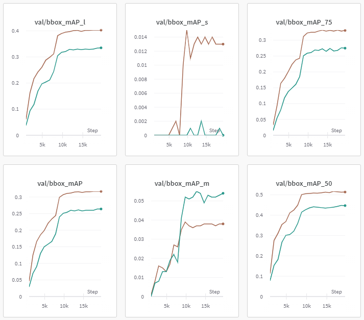

#Backbone
##Faster R-CNN 실험
###ResNet-50, ResNet-101, ResNeXt-101 backbone에 따른 성능 비교 실험
####가설

Base model(Faster R-CNN, r50)의 평가 지표에서 train loss가 수렴을 하였음에도 train mAP값이 낮아 underfitting이 일어나고 있다고 판단, 파라미터 수가 더 많은 모델이 mAP를 높여줄 것이다.

- mmdetection에서 제공한 r50, r101, x101 성능 비교 자료
    
    
    | Backbone | Lr schd | Mem (GB) | box AP |
    | --- | --- | --- | --- |
    | R-50-FPN | 1x | 4.0 | 37.4 |
    | R-50-FPN | 2x | - | 38.4 |
    | R-101-FPN | 1x | 6.0 | 39.4 |
    | R-101-FPN | 2x | - | 39.8 |
    | X-101-32x4d-FPN | 1x | 7.2 | 41.2 |
    | X-101-32x4d-FPN | 2x | - | 41.2 |
    
    우리의 task에서도 비슷한 성능을 보이지 않을까?
    

####실험 결과

| title | train loss | val mAP50 | TEST mAP |
| --- | --- | --- | --- |
| faster-rcnn_resnet50_fpn_sgd_512 | 0.3672 | 0.396 | 0.3929 |
| faster-rcnn_resnet101_fpn_sgd_512 | 0.3565 | 0.407 | 0.4189 |
| faster-rcnn_resnext101_fpn_sgd_512 |  | 0.439 | 0.4369 |

####결과 분석

- 예상대로 r50 < r101 < x101 순으로 좋은 성능을 보여줬다.
- train loss 는 0.4~0.5 정도를 맴돌며 더이상 내려가지 않았다.
- ResNeXt backbone에서 사용한 기법이 우리의 Task를 더 잘 풀어내는 것으로 판단했다.
    
##Cascade R-CNN Backbone 실험
####가설
Faster R-CNN 에서의 Backbone 실험 결과와 동일하게 r50 < r101 < x101 순으로 좋은 성능을 보여줄 것이다.

####실험 결과

####결과 분석
- train loss 에서 미세하지만 ResNext-101 모델이 성능이 제일 좋았다.
- validation 지표에서도 예상했던대로 r50 < r101 < x101 순의 성능 차이를 보였다.
- mAP_s 에 대한 내용은 모델이 학습을 통해 맞추기에는 쉽지 않은 것 같다.

##Backbone 모델 :  swin-T, swin-L에 따른 성능 비교 실험
####가설2  
모델이 예측한 결과를 streamlit을 이용해 직접 본 결과 classification을 제대로 하지 못해, classification성능이 더 좋은 모델을 사용하면 mAP가 오를 것으로 추측함.

####실험

- ResNet에 비해 classification성능이 좋은 swin transformer계열의 모델을 사용하기로 함.
- swin-T, swin-L 모델의 validation mAP비교

🧑🏻‍🔬 실험 결과

| title | train loss | val mAP50 |
| --- | --- | --- |
| faster_rcnn_swint_fpn_sgd_512 | 0.4586 | 0.447 |
| faster_rcnn_swinl_fpn_sgd_512 | 0.4154 | 0.514 |

- 작은 사이즈의 bbox mAP값에서 특히 큰 차이를 보여주었고, 전반적으로 모두 mAP값이 오름.

####결과 분석

- 작은 사이즈의 bbox mAP값은 현재 512사이즈로 실험 하고 있으므로 1024로 바꾼다면 더 오를 것으로 예상되고, neck을 PAFPN으로 바꿔준다면 각 층의 feature를 한번 더 섞어주므로 더 높은 성능을 보여줄 것으로 예상됨.
- train loss는 backbone을 resnet으로 했을 때 보다 오히려 더 높은 값에서 수렴함. → SGD로는 현재의 local minima에서 빠져나올 수 없는듯.