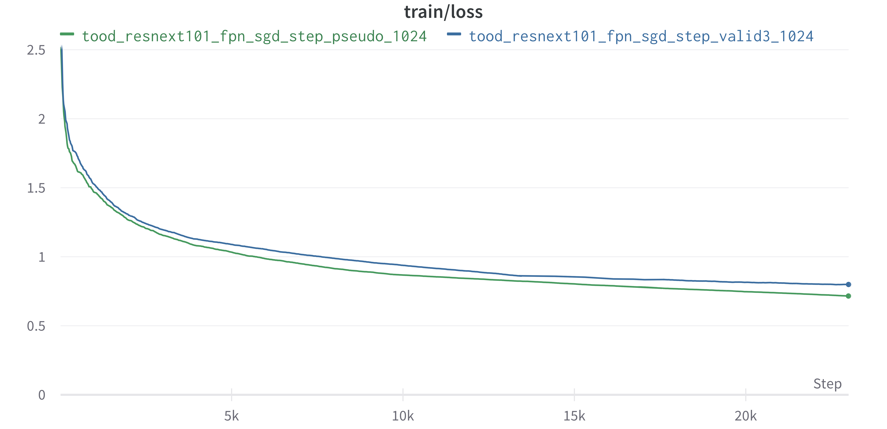

#Detector
##1-Stage
###valid set 에 가장 높은 성능을 내는 1-stage 모델 찾기

|      Detector |      Backbone | Neck | Optimizer | Scheduler | Dataset | Image Size |
| --- | --- | --- | --- | --- | --- | --- |
| ssd | vgg-16 | fpn | sgd | step lr | valid3 | 1024 |
| retinanet | swin-tiny | fpn | sgd | step lr | valid3 | 1024 |
| yolo-x | cspdarknet-53 | fpn | sgd | step lr | valid3 | 1024 |
| tood | resnext-101 | fpn | sgd | step lr | valid3 | 1024 |
- ssd: 18 min/epoch
retinanet: 11 min/epoch
yolo-x: 18 min/epoch
tood: 17 min/epoch
- 다양한 1-stage 모델들을 detector 와 backbone 만 조작변인으로 두고 neck, optimizer, scheduler, dataset, image size, augmentation 은 통제변인으로 유지시킨 체 실험하였다.
- train loss 만 본다면 retinanet과 tood가 비슷한 성능을 내기 때문에 차후 빠른 실험을 위해 epoch 당 training time이 적은 retinanet을 선택할 수 있지만, valid set 에 대한 성능, 특히 small object mAP 와 medium object mAP 에서는 tood 가 압도적으로 높았기 때문에 tood 를 1-stage 메인 모델로 선정하였다.

###tood 성능 향상 실험
####가설 1
        
mosaic augmentation을 적용시키면 동일한 epoch 에서 total mAP 는 증가하겠지만 small object mAP는 하락 할 것이다. train set 4장을 한장으로 mosaic augmentation 기법을 적용시키면 한 epoch 당 학습하는 사진이 4배 많아지는 것이기 때문에 total mAP 는 증가할 것이지만, 1024x1024 사진이 256x256 사진으로 축소되어 학습되기 때문에 작은 물체 탐지 능력은 오히려 떨어질 것으로 예상한다.

####실험 결과

1-stage 메인 모델로 선정한 tood 에서 mosaic augmentation만 조작변인으로 두고 valid dataset에 대한 total mAP와 small object mAP를 관찰하였다.

| Detector |  Backbone | Neck | Optim. | Sched. | Dataset |    Augmentation | Image Size |
| --- | --- | --- | --- | --- | --- | --- | --- |
| tood | resnext-101 | fpn | sgd | step lr | valid3 | - | 1024 |
| tood | resnext-101 | fpn | sgd | step lr | valid3 | mosaic | 1024 |

tood: 17 min/epoch, tood+mosaic: 53 min/epoch

####결과 분석

동일 epoch에서 total mAP는 미세하게 상승하였고 small object mAP는 미세하게 하락하였다. 더 길게 돌려보아야 통계적으로 유의미한 결과를 얻을 수 있을 것이지만, batch size 를 최소한으로 두었음에도 몇 epoch 학습 후에 메모리 에러가 계속해서 뜨기도 했고, 학습시간도 너무나 길었기에 mosaic 실험은 여기서 끝내기로 하였다.

####가설 2

pseudo labeled dataset을 활용해서 모델을 학습시키면 train loss가 하락 할 것이다. 현재까지 가장 성능이 좋은 모델을 활용하여 제작한 pseudo labeled dataset을 학습에 활용하면 완벽하지 않은 labeling이 오히려 dropout처럼 작용하여 성능이 향상될 것으로 예상한다.

####실험 결과

1. valid dataset을 뗀 train dataset으로 학습한 모델
2. valid dataset을 떼지 않은 train dataset 전체 + pseudo labeled dataset 으로 학습한 모델의 train loss를 관찰하였다. valid dataset을 학습에 이용했기 때문에 valid score은 쓰지 않았다.

| Detector |  Backbone | Neck | Optim. | Sched. |                  Dataset | Image Size |
| --- | --- | --- | --- | --- | --- | --- |
| tood | resnext-101 | fpn | sgd | step lr | valid3 (train에서 valid 뗀) | 1024 |
| tood | resnext-101 | fpn | sgd | step lr | train 전체 + pseudo labeled | 1024 |
|  |  |  |  |  |  |  |

tood: 17 min/epoch, tood+pseudo: 40 min/epoch

####결과 분석

성능 향상이 있었지만 valid dataset을 학습에 활용한 것이니 당연한 결과이다. pseudo labeled dataset의 활용 여부만 조작변인으로 두었어야 했지만 valid dataset의 추가여부가 통제되지 않아서 실험 의도대로 pseudo labeled dataset 활용 여부만의 성능을 평가하기가 쉽지 않게 되었다. 2-stage 실험에서 pseudo labeled dataset만 조작변인으로 두었을 때 성능이 향상된 것으로 보아 1-stage 에서도 그럴 것으로 판단하여, 이후 실험들에서는 pseudo labeled dataset은 항상 활용하기로 하였다.

####가설 3

deformable convolution을 활용하여 모델을 학습시키면 얇은 bounding box를 가진 small object에 대한 detection 성능이 향상되어, small object mAP가 향상될 것이다. EDA를 하다 보면 유독 빨대나 판자 같이 얇은 물체들을 잘 찾아내지 못했는데, receptive field가 정사각형으로 고정된 것이 아니라 자유자재로 offset 되어 변형되는 deformable convolution을 활용하면 이러한 물체들을 잘 잡아낼 것이라 예상한다.

####실험 결과

deformable convolution의 적용 여부만 조작변인으로 두고  valid dataset에 대한 total mAP와 small object mAP를 관찰하였다. valid dataset이 train 과정에서 활용되긴 하였지만, 실험하는 두 모델들이 똑같은 dataset으로 학습하였기 때문에 deformable convolution 적용 후 상대적인 성능 비교를 위해 valid dataset에 대한 결과값을 사용하였다.

| Detector | Backbone | Neck | Optim. | Sched. |      Dataset | Deform Conv. | Image Size |
| --- | --- | --- | --- | --- | --- | --- | --- |
| tood | x-101 | fpn | sgd | step lr | train+pseudo | X | 1024 |
| tood | x-101 | fpn | sgd | step lr | train+pseudo | O | 1024 |

tood+pseudo: 40 min/epoch, tood+pseudo+deformable convolution: 71 min/epoch

####결과 분석

기술적 문제로 deformable convolution을 적용한 모델을 적용하지 않은 모델과 동일한 epoch까지 학습시키지는 못하였지만, 같은 epoch에서의 결과값을 비교해보면 큰 폭으로 성능이 향상됨을 알 수 있었고, 특히 가설에서 예상한 대로 작은 물체에 대한 성능이 가장 크게 올랐다.