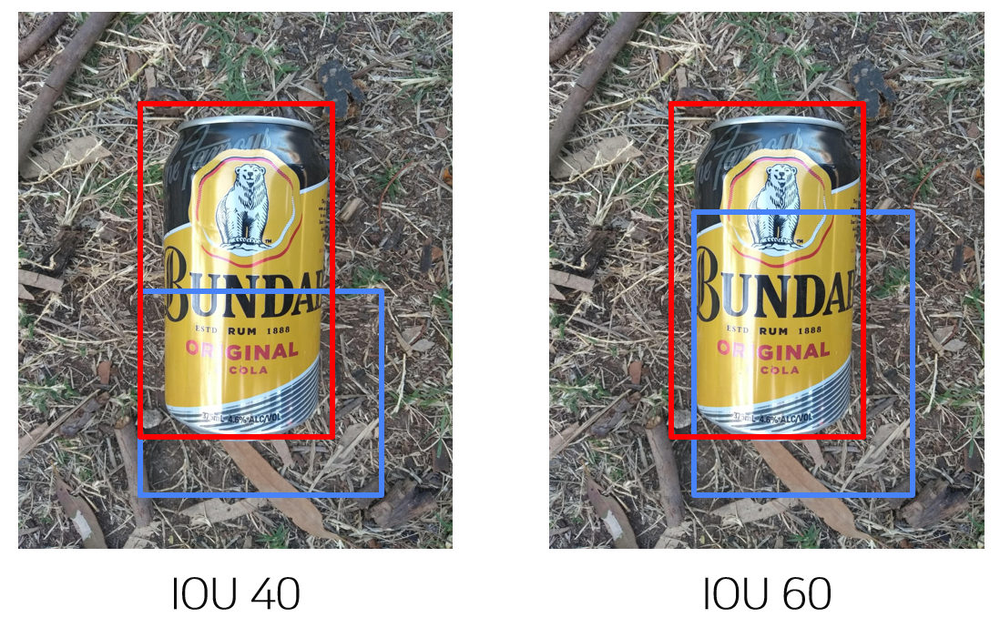

# Detector
## 2-Stage
### Faster R-CNN vs Cascade R-CNN
#### 가설
Faster R-CNN 모델의 문제점을 지적하고 이를 개선한 모델인 Cascade R-CNN 모델이 더 나은 Detector일 것이다 라고 예상하고 가설을 세움
>🔍 **casecade 간단 리뷰**
>Faster R-CNN 의 과정을 간단하게 살펴보자. 
>1. Faster R-CNN은 input 이미지에서 ResNet 같은 backbone 네트워크로 features 를 추출한다.
>2. 추출한 features 를 기반으로 RPN 이 object 의 위치(Bbox)를 추천해준다.
>3. ROI Pooling을 통해 feature 상에서의 Bbox 에서 실제 image 의 Bbox를 얻어온다.
>4. classifier가 Regressor를 통해 Bbox를 재조정한다.
>5. classifeir가 조정된 Bbox를 classification 한다.
>classifier는 regressor, classification 두 단계에 걸쳐 Bbox의 물체를 detect한다. classifier는 RPN이 추천해준 Bbox와 Ground Truth의 Bbox 를 비교한다. 두 Bbox가 얼마나 비슷하면 같은 물체로 보겠는가에 대한 수치가 바로 IoU(Intersection of Union)이다. input 이미지의 IoU에 따라 Regressor의 성능은 달라지는데, 0.5 정도의 낮은 IoU를 갖는 Bbox가 들어올 때 Regressor는 높은 성능을 발휘한다(GT에 가깝게 Bbox를 regress시켜 IoU를 많이 높여준다). 
>
>Cascade R-CNN 모델은 classifier를 여러 개 사용하는 구조를 가진다. IoU 가 낮은(예를 들면 0.5) Bbox를 regress해서 다시 더 높은 IoU를 갖는 classifier에 넣어주는 구조이다. regress 를 여러번 하는 만큼 output IoU의 값은 점점 높아져 Ground Truth에 가까워져 성능이 더 올라갈 것이다.
>
>참고
[https://blog.lunit.io/2018/08/13/cascade-r-cnn-delving-into-high-quality-object-detection/](https://blog.lunit.io/2018/08/13/cascade-r-cnn-delving-into-high-quality-object-detection/)

#### 실험 결과

#### 결과 분석
- Cascade R-CNN 모델이 Classifier를 3개 사용하는 만큼 Bbox mAP 성능이 대체적으로 더 좋았다.
- 유일하게 작은 물체에 대한 성능은 Faster R-CNN 이 더 나았는데, mAP_m, mAP_l 수치에 비해 너무 작은 수치여서 무시하기로 했다.
- 한가지 의문점은 mAP_m, mAP_l 의 성능은 Cascade R-CNN 모델이 더 좋은데, mAP_50에서의 성능은 비슷한 것이 의문인데,,, Cascade R-CNN 모든 classifier에 IoU를 0.5로 설정했을 때의 성능이 아닐까? 라는 생각이 든다.