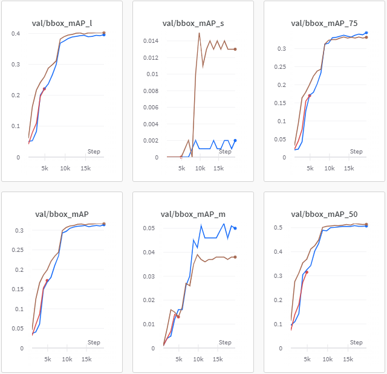

# Neck
## 512사이즈 Neck실험
#### 가설
작은 bbox의 mAP값은 neck을 바꿔 줌으로써 올라갈 것이다.

#### 실험 결과
- faster-rcnn, swin-L, adamw, step, 512사이즈 등 다른 조건들은 고정하고 neck만을 FPN, PAFPN, NASFPN으로 변경하여 실험함.
- (빨간색 : nasfpn, 갈색 : fpn, 파란색 : pafpn)

- pafpn이 오히려 더 낮은 성능을 보여줌, 작은 bbox에 대한 mAP도 오히려 더 낮음
- nasfpn은 너무 느려서 실험 중단

#### 결과 분석:

- pafpn이 오히려 더 낮은 성능을 보여줌, 작은 bbox에 대한 mAP도 오히려 더 낮음
- nasfpn은 너무 느려서 실험 중단
* * *
## 1024사이즈 Neck 실험
#### 가설
정보가 더 많은 1024사이즈의 이미지로 실험하면 PAFPN이 mAP가 더 높을 것이다.

#### 설명

- faster-rcnn, swin-L, adamw, step, 1024등 Neck을 제외한 다른 조건들은 같게 함.
- 정보가 더 많은 1024사이즈의 이미지로 실험하여 512사이즈에서 pafpn이 오히려 더 낮은 성능을 보여준 것에 대한 의구심을 풀고자 함.

#### 실험 결과

| title | train loss | test mAP |
| --- | --- | --- |
| faster_rcnn_swin-L_fpn_adamw_aug12_1024 | 0.527 | 0.6257 |
| faster_rcnn_swin-L_pafpn_adamw_aug12_1024 | 0.5 | 0.6251 |
- fpn의 mAP가 더 높음

#### 결과 분석

- 작은 사이즈의 bbox mAP값은 현재 512사이즈로 실험 하고 있으므로 1024로 바꾼다면 더 오를 것으로 예상되고, neck을 PAFPN으로 바꿔준다면 각 층의 feature를 한번 더 섞어주므로 더 높은 성능을 보여줄 것으로 예상됨.
- train loss는 backbone을 resnet으로 했을 때 보다 오히려 더 높은 값에서 수렴함. → SGD로는 현재의 local minima에서 빠져나올 수 없는듯.