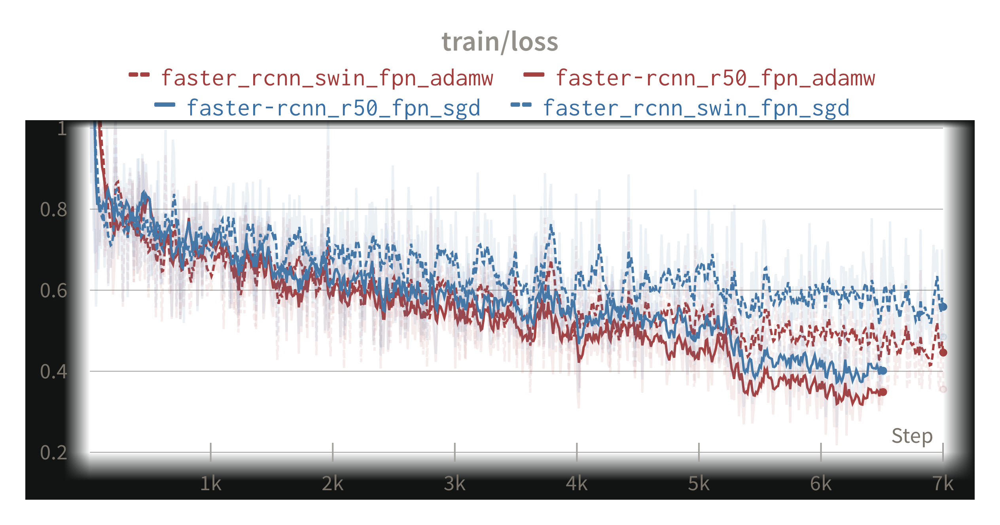
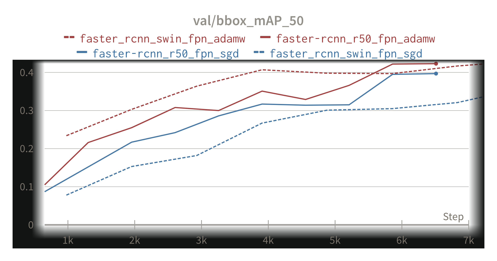

# Optimizer

#### 가설

- 빠른 실험 및 정확한 결과 도출을 위하여, 수렴 속도가 빠르면서도 global minimum을 잘 찾아낼 수 있는 optimizer 탐색을 진행하기로 함.
- 동일한 조건 하에서 SGD 보다 더 일반화 성능이 좋은 optimizer를 사용하여 실험을 진행해 봄.

#### 실험 결과

- backbone 모델(ResNet50, SwinTransformer의 두 가지 실험 진행)과 무관하게, AdamW 가 SGD 보다 더 빠른 수렴 속도와 함께 validation 시 mAP 점수도 더 높은 모습을 보임.

#### 결과 분석

- AdamW 가 SGD에 비해 local minimum에 빠지는 경향도 적으면서 더욱 빠르게 실험할 수 있는 optimizer 라는 결론을 얻음.
- 두 실험 모두 loss가 마지막으로 수렴하는 지점까지 학습을 시키지는 않았기 때문에, SGD가 수렴 속도가 느릴지언정 minimum point에 도달하지 못한다고 볼 수는 없음.
