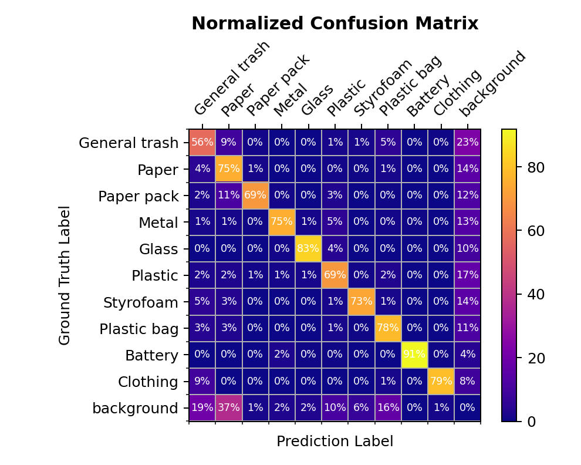

# Postprocessing

## pseudo detection

####가설

- 모델이 검출한 결과의 confusion matrix 를 확인해 보니, paper 로 검출했으나 사실은 general Trash, paper Pack 인 경우가 많았음 (각 9%, 11%).
- 또한, 이미지를 육안으로 확인해 봤을 때 플라스틱과 쇠로 된 쓰레기가 사람이 보아도 서로 구별하기 힘든 경우가 많았음.
- 이에, 모델이 높은 confidence score로 예측한 바운딩 박스와 동일한 위치에 해당 예측 클래스와 혼동이 자주 일어나는 클래스의 바운딩 박스를 추가한다면 이에 따라 recall 값이 높아질 것이라고 판단함.
- 기존 검출 중 confidence score가 0.3 이상인 검출을 대상으로, 위와 같은 ‘가짜 검출’ 박스를 0.15의 confidence score 로 추가해 줌.

####실험 결과

|  | mAP50 |
| --- | --- |
| 기존 제출 | 0.6718 |
| + pseudo detection | 0.6626 |
- 새롭게 추가한 검출은 confidence score를 낮췄음에도 불구하고 오히려 제출 시 점수가 하락한 결과를 보임.

####결과 분석

- 모델이 검출해낸 결과 중 낮은 confidence score에서도 true positive인 검출이 상당수 존재한다는 것을 확인함.

## nms

####가설

- 모델이 마지막으로 결과를 내는 rcnn의 classification head에서 중복된 bounding box를 걸러내는 Non-Maximum Supression(NMS) 과정에서, 실제로 겹쳐 있는 ground truth 데이터에 대한 검출을 제외시켜 버리는 현상 때문에 제출 성능이 낮아질 수 있다는 가설을 세움.
- NMS 방식을 soft-NMS  방식으로 변경하여 실험해 보기로 함.

####실험 결과

|  | mAP50 |
| --- | --- |
| NMS | 0.5328 |
| Soft-NMS | 0.5308 |

####결과 분석

- inference 시 모델이 검출해낸 결과에는 실제로 동일한 ground truth 물체에 대해 중복으로 검출한 결과가 많다는 것을 확인함.
- 결국, 겹쳐진 물체에 대한 검출을 포함시켜서 올라가는 mAP 점수의 상승폭보다 중복 검출을 제외시키지 않아서 내려가는 점수의 하락폭이 더 크다는 것을 유추할 수 있음.
- RCNN 헤드에서는 기본 NMS를 사용하고, soft-NMS 나 Weighted Boxes Fusion(WBF) 와 같은 기법은 여러 모델을 앙상블할 때에 사용하는것이 바람직함.
