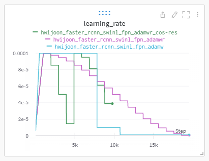
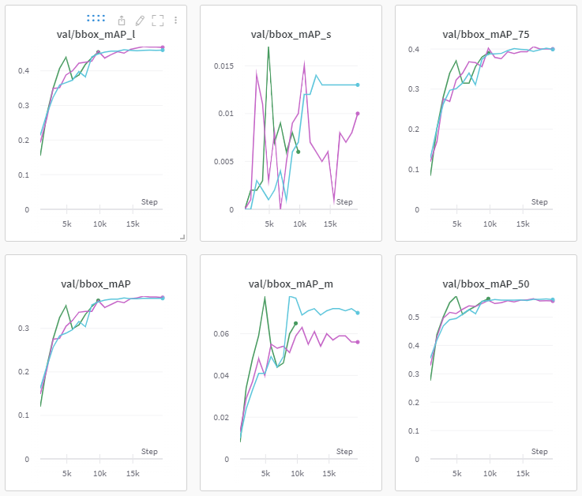

#Scheduler
####가설

- 8epoch를 기점으로 급격히 떨어지는 lr로 인해 더 낮은 local minima를 찾지 못했을 것이라 생각하고, 다른 scheduler를 사용하면 더 높은 mAP를 뽑아낼 것으로 예상함.

####설명

- (파랑 : step, 분홍 : cosineannealing, 초록 : cosinerestart)

####실험 결과

- cosine restart가 6epoch만에 실험의 향방을 미리 보여줌
- cosine restart가 다른 scheduler에 비해 높은 mAP를 보여줌

####결과 분석

- CosineRestart가 더 낮은 local minima를 찾아냄. 하지만 다른 조건의 실험일 경우 더 낮은 local minima를 찾아 낼 수 있다는 보장은 없음.
- CosineRestart가 실험 결과를 빠르게 예상할 수 있게 해줌.