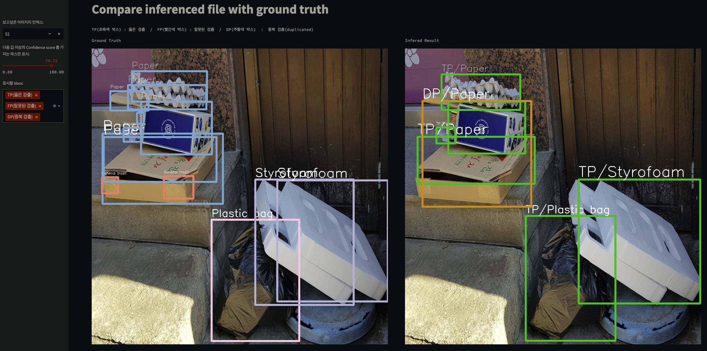

# Streamlit Visualization
## Ground Truth 가 존재하는 파일에 대한 inference 결과를 시각화합니다.
#
  
#
### how to start
```
pip install streamlit
```
#
### modify
parser 를 사용해 실행합니다.
1. --submission_csv = inference 한 submission.csv 파일 경로
2. --gt_json = ground truth 의 메타데이터 json 파일 경로
3. --dataset_path = 전체 데이터가 존재하는 경로

streamlit parser 뒤에 -- 입력 후 argparse 인자가 입력되어야 합니다.
사용 예) streamlit run app.py --server.fileWatcherType none --server.port=30005 -- --submission_csv ./submission_for_train.csv --gt_json /opt/ml/JDP/dataset/train.json --dataset_path /opt/ml/JDP/dataset/
#
### run
```
streamlit run app.py --server.fileWatcherType=none --server.port=30005 --
```
